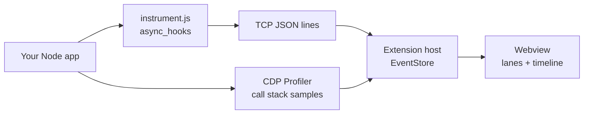

# Looper — Event Loop Visualizer

A VS Code extension that visualizes the Node.js **call stack**, **microtask queue**,
and **macrotask queue** live — using your real function names — without modifying,
wrapping, or adding any dependency to your app.


### Working demo


---

## Usage

1. `Cmd/Ctrl+Shift+P` → **Looper: Launch & Visualize**
2. Pick a launch command (active file, `sample-app`, demo fixture, or custom)
3. Exercise your app (e.g. `curl http://localhost:3000/login`)
4. Use the panel:
   - **Live** — follow new events as they arrive
   - **Stop** — kill the target process and freeze capture (replay still works)
   - **Clear** — wipe timeline / lanes only; the process keeps running
   - **Play / scrub / speed** — replay captured activity slowly

Or **Attach to Running Process** and enter an inspector port (default `9229`) for an
app already started with `--inspect`.

---

## How the logic works

Looper is a **teaching visualization** of the common “call stack + microtasks +
macrotasks” mental model. It is **not** a literal dump of every libuv phase.



### 1. Injecting without touching your repo

| Mode | Mechanism |
|------|-----------|
| **Launch** | Spawns your command with `NODE_OPTIONS=--require <agent> --inspect=<port>` and `EVENTLOOP_VIZ_PORT`. The agent file lives inside the extension install dir — nothing is written to your `node_modules` or `package.json`. |
| **Attach** | Connects to an existing inspector and `Runtime.evaluate`s the agent source into the live process. Only activity *after* attach is visible. |

### 2. Queues — `async_hooks` agent

[`src/agent/instrument.js`](src/agent/instrument.js) enables an `async_hooks` hook and
tracks `PROMISE`, `Timeout`, `Immediate`, and `TickObject` by default:

| Hook | What we do in the UI |
|------|----------------------|
| `init` | Enqueue a chip in **microtask** (`PROMISE`, `TickObject`) or **macrotask** (`Timeout`, `Immediate`). Label comes from the nearest **named user frame** on the creation stack (skips `node:`, `node_modules`, and the agent itself). |
| `before` | Chip leaves its queue and is pushed onto the **call stack** as “running” (with a short fly animation). |
| `after` / `destroy` | Remove from stack / queues. |
| `promiseResolve` | Remove resolved promises from the microtask lane. Promises often never get timely `before`/`destroy` (GC-delayed), so without this chips would stick forever. |

Why the same name can appear in **both** queues: e.g. `checkRedis` does
`new Promise(...)` **and** `setTimeout(...)`. Those are two resources. Chips carry
a type badge (`Promise` / `Timeout` / …) so they stay distinguishable.

### 3. Call stack — CDP sampling profiler

The extension host talks to V8 over the Chrome DevTools Protocol:

- Start a sampling window, periodically `Profiler.stop` → walk the **parent chain**
  of the latest sample → `Profiler.start` again.
- That yields a real root→leaf stack (not a flat list of leaf hits).
- Short promise callbacks often finish between samples, so the UI also **synthesizes**
  stack frames from async `before` events. Sampling and hooks share one clock by
  stamping stacks with target-process `performance.now()` (calibrated skew).

### 4. Transport and replay

- Agent → extension: newline-delimited JSON over a local TCP socket.
- Extension → webview: `postMessage` event stream; host keeps an `EventStore` for history.
- **Replay** (play / scrub / speed) runs in the webview against its event buffer.
  Speed options are ≤ 1× with a minimum gap so dense bursts stay readable.
- **Clear** clears store + UI only. **Stop** tears down process, CDP, and agent.

### 5. Motion / lanes (teaching UI)

Three color-coded lanes (stack / micro / macro). Motion vocabulary:

1. **Enqueue** — fly from stack leaf → queue chip  
2. **Run** — fly from queue → stack  
3. **Complete** — fade out  

Concurrent flies are capped; `prefers-reduced-motion` falls back to simple fades.

---

## TypeScript projects

**Source maps are not wired yet.** The visualizer attaches to the **running Node
process**, so what you see is whatever V8 is executing:

| You run | What Looper shows |
|---------|-------------------|
| Compiled JS (`node dist/server.js`, `tsc` output) | Function names from the compiled file; line numbers point at **`.js`**, not `.ts` |
| `tsx` / `ts-node` on a `.ts` file | Often works for **names**, but locations still follow the runtime’s view (transpile-only / loader), not a mapped `.ts` editor path |
| Bundled apps (esbuild/webpack/etc.) without maps in the inspector | Bundled names / paths |

Practical guidance today:

- Prefer launching the **compiled** entry (`node dist/...`) for predictable results.
- The Launch picker can suggest `npx tsx <file.ts>` for an open TypeScript file — useful for demos, not a substitute for source-map support.
- Named `function` / `async function` declarations visualize best; anonymous arrows still show as anonymous / `anon (file:line)`.

Full TypeScript source-map mapping (click-through to `.ts`) is on the roadmap.

---

## Project layout

```
src/
  agent/instrument.js      # async_hooks agent (injected into target)
  debug/                   # CDP client + process launch/attach
  transport/agentServer.ts # TCP receiver for agent events
  webview/                 # panel HTML + media (UI)
  extension.ts             # commands, session lifecycle
  stateStore.ts            # captured event buffer
  shared/types.ts
assets/                    # screenshots + demo
fixtures/event-loop-demo.js
```

## Known limitations (v0.1)

- Anonymous inline callbacks show as anonymous / `anon (file:line)`.
- Visualizes the call stack + micro/macrotask **mental model**, not every libuv phase.
- No TypeScript/bundler source-map resolution yet (see above).
- Worker threads / cluster / child processes each need their own agent (not multiplexed).
- `async_hooks` adds overhead — use as a debug-time tool, not in production.

## Roadmap

1. Source-map support for TypeScript and bundled apps  
2. Worker / cluster process picker  
3. Persist replay sessions to disk  
4. Blackbox / allowlist for `node_modules` frames  
